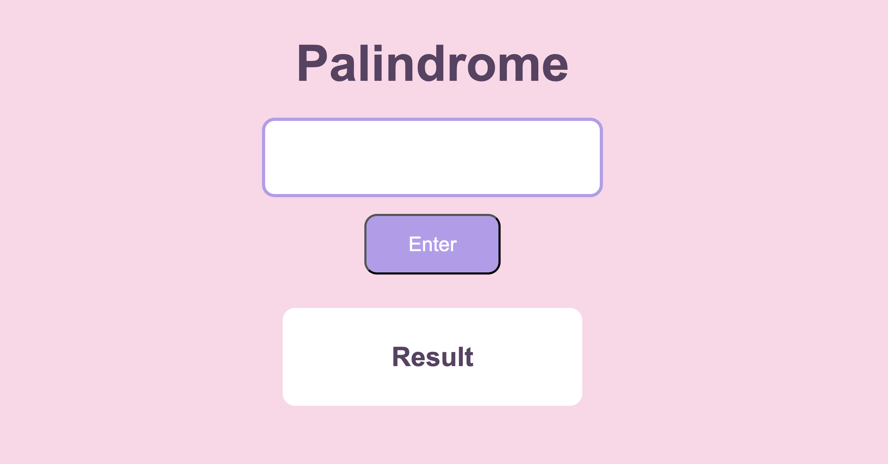

# 🔁 Server Side Palindrome Checker

A simple **Node.js web application** that checks whether a word or phrase is a palindrome, with the check happening on the **server side**. 🧠

## 📸 Project Preview

<!-- Add your screenshot below -->


## ✨ Features

- Enter a word or phrase to check
- Palindrome validation runs on the server
- Serves HTML and CSS files using Node's `fs` module
- Handles requests using Node's `http` module
- Displays the result on the page
- Simple and user-friendly interface

## 🛠️ Built With

- HTML
- CSS
- JavaScript
- Node.js
- `http` module
- `fs` module

## 🎯 Project Goal

The goal of this project was to build a web application that validates a palindrome **server side** using only Node's built-in `http` and `fs` modules, with no frameworks.

The user submits a string, the server checks it, and the result is sent back to the browser.

## 💡 What I Learned

This project was my introduction to building a basic web server from scratch with Node.js.

I also gained more experience working with:

- Creating a server with the `http` module
- Reading and serving files with the `fs` module
- Handling requests and responses
- Routing
- Query strings and user input
- String methods
- Server-side vs. client-side logic

One of the biggest takeaways was seeing how the **server processes data and sends a response back**, instead of everything happening in the browser.

## 🚀 Running the Project

To run this project locally:

1. Clone the repository:

```bash
git clone https://github.com/your-username/node-palindrome-bootcamp.git
```

2. Navigate into the project folder.

3. Start the server:

```bash
node server.js
```

4. Open `http://localhost:8000` in your browser.

5. Enter a word or phrase and see if it's a palindrome! 🔁

---

Thanks for checking out my project! 🔁✨